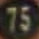
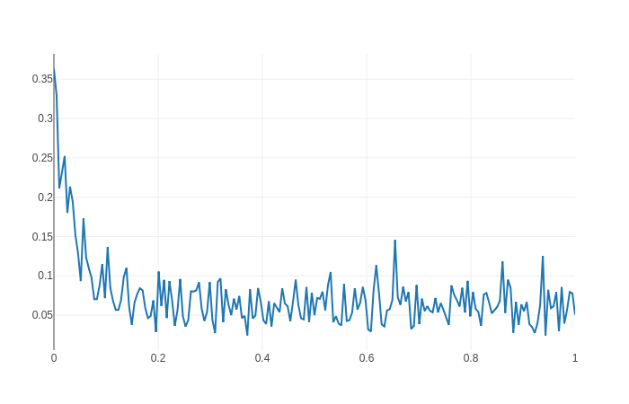

# SVHNClassifier-PyTorch

A PyTorch implementation of [Multi-digit Number Recognition from Street View Imagery using Deep Convolutional Neural Networks](http://arxiv.org/pdf/1312.6082.pdf) 

> If you're interested in C++ inference, move [HERE](cpp)

## Results

<table>
    <tr>
        <th>Steps</th>
        <th>GPU</th>
        <th>Batch Size</th>
        <th>Learning Rate</th>
        <th>Patience</th>
        <th>Decay Step</th>
        <th>Decay Rate</th>
        <th>Training Speed (FPS)</th>
        <th>Accuracy</th>
    </tr>
    <tr>
        <td>
            <a href="https://drive.google.com/open?id=1DSg3F5GpouEvU9n7YSPdUKH1CSmkdwSw">
                54000
            </a>
        </td>
        <td>GTX 1080 Ti</td>
        <td>512</td>
        <td>0.16</td>
        <td>100</td>
        <td>625</td>
        <td>0.9</td>
        <td>~1700</td>
        <td>95.65%</td>
    </tr>
</table>

### Sample


```
$ python infer.py -c=./logs/model-54000.pth ./images/test-75.png
length: 2
digits: 7 5 10 10 10
```


```
$ python infer.py -c=./logs/model-54000.pth ./images/test-190.png
length: 3
digits: 1 9 0 10 10
```


### Loss



## Requirements

* Python 3.6
* torch 1.0
* torchvision 0.2.1
* visdom
    ```
    $ pip install visdom
    ```
    
* h5py
    ```
    In Ubuntu:
    $ sudo apt-get install libhdf5-dev
    $ sudo pip install h5py
    ```

* protobuf
    ```
    $ pip install protobuf
    ```

* lmdb
    ```
    $ pip install lmdb
    ```

## Setup

1. Clone the source code

    ```
    $ git clone https://github.com/potterhsu/SVHNClassifier-PyTorch
    $ cd SVHNClassifier-PyTorch
    ```

2. Download [SVHN Dataset](http://ufldl.stanford.edu/housenumbers/) format 1

3. Extract to data folder, now your folder structure should be like below:
    ```
    SVHNClassifier
        - data
            - extra
                - 1.png 
                - 2.png
                - ...
                - digitStruct.mat
            - test
                - 1.png 
                - 2.png
                - ...
                - digitStruct.mat
            - train
                - 1.png 
                - 2.png
                - ...
                - digitStruct.mat
    ```


## Usage

1. (Optional) Take a glance at original images with bounding boxes

    ```
    Open `draw_bbox.ipynb` in Jupyter
    ```

1. Convert to LMDB format

    ```
    $ python convert_to_lmdb.py --data_dir ./data
    ```

1. (Optional) Test for reading LMDBs

    ```
    Open `read_lmdb_sample.ipynb` in Jupyter
    ```

1. Train

    ```
    $ python train.py --data_dir ./data --logdir ./logs
    ```

1. Retrain if you need

    ```
    $ python train.py --data_dir ./data --logdir ./logs_retrain --restore_checkpoint ./logs/model-100.pth
    ```

1. Evaluate

    ```
    $ python eval.py --data_dir ./data ./logs/model-100.pth
    ```

1. Visualize

    ```
    $ python -m visdom.server
    $ python visualize.py --logdir ./logs
    ```

1. Infer

    ```
    $ python infer.py --checkpoint=./logs/model-100.pth ./images/test1.png
    ```

1. Clean

    ```
    $ rm -rf ./logs
    or
    $ rm -rf ./logs_retrain
    ```
